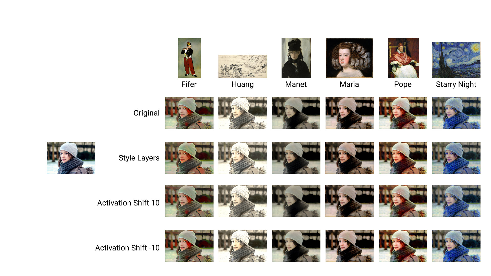
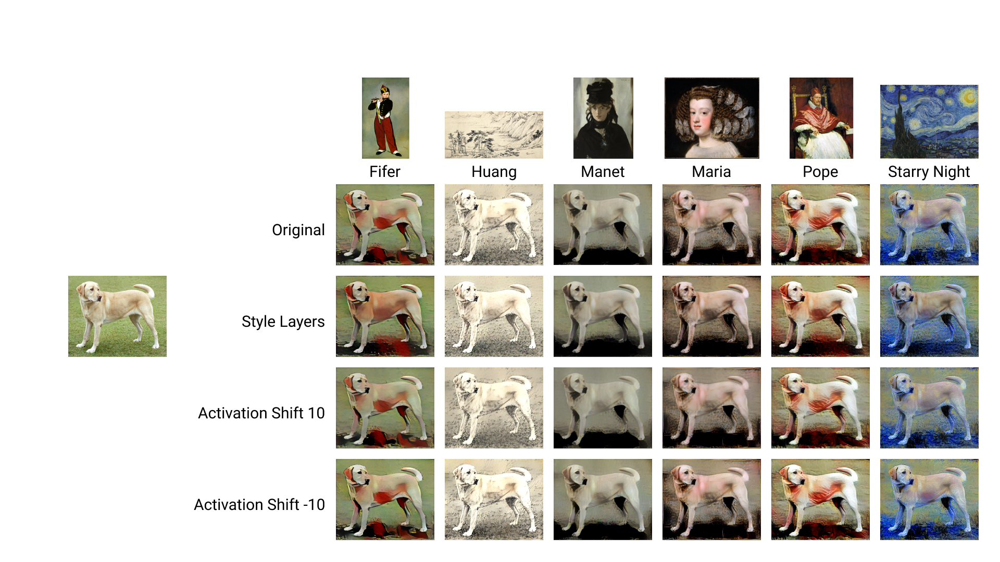
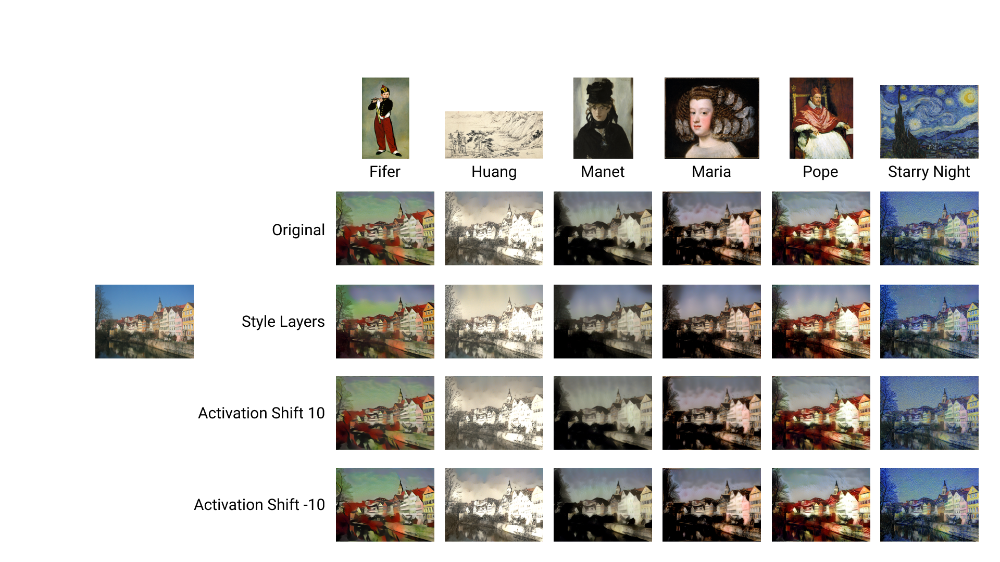
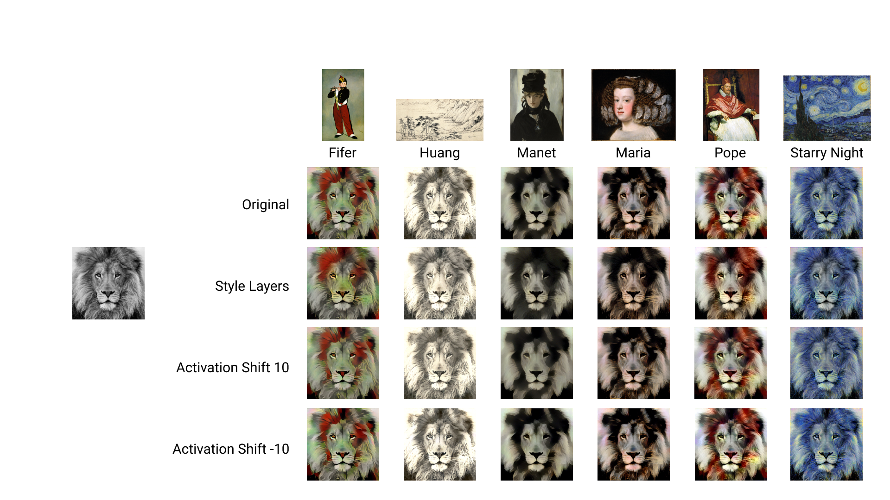
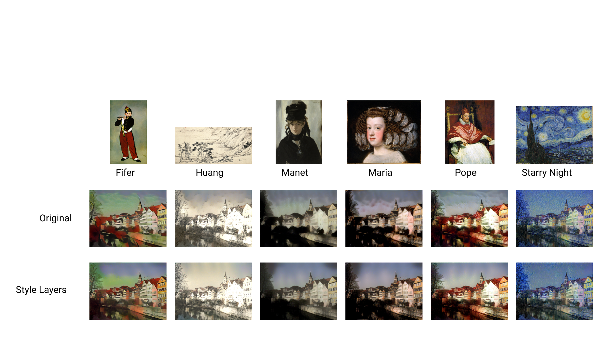
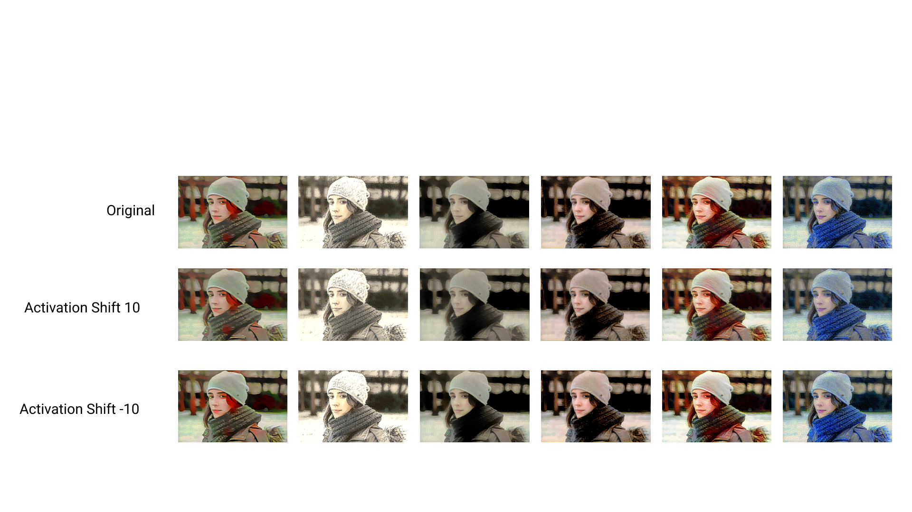
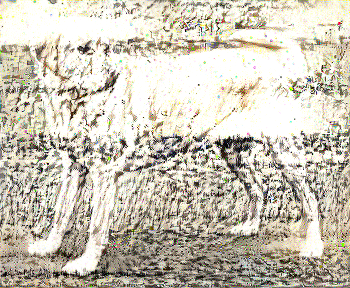

# neural-style-tf
This implementation applies some optimizations from paper [Improving the Neural Algorithm of Artistic Style](https://arxiv.org/abs/1605.04603) to the implementation of the original algorithm available [here](https://github.com/cysmith/neural-style-tf)
### Examples 

### Evaluation for style layers
To use multiple layers for style loss, use argument `--style_layers layers`

### Evaluation for activation shift
To use activation shift, use argument `--activation_shift value`. *Default*: `0`

### Evaluation for correlation chain
To use activation shift, use argument `--correlation_chain`. 

For more usage please refer to the [github page](https://github.com/cysmith/neural-style-tf) of the source code we are using.
